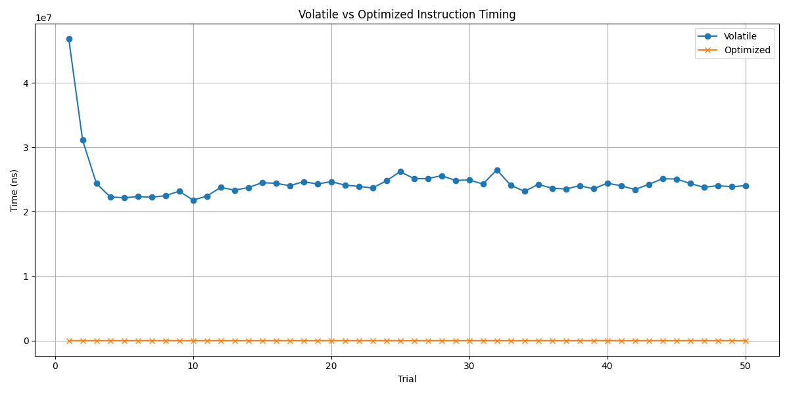

# Volatile vs Optimized Instruction Timing

This project compares the execution time of volatile and optimized operations in C++ to understand how the CPU's reorder buffer (ROB) interacts with independent instructions. The experiment involves two C++ functions: one that uses volatile variables and artificial delays to prevent optimization, and one that allows the compiler and CPU to optimize and reorder the instructions.

### Project Structure

1. **C++ Code**:
   - `main.cpp`: Contains the main logic for measuring execution times of both volatile and optimized operations.
   - The results are written to a CSV file for later analysis.

2. **Python Script**:
   - `plot_results.py`: A script that loads the results from the CSV file and generates a plot comparing the volatile and optimized operation times.

### Requirements

- **C++ Dependencies**:
  - **Kaizen Library**: For argument parsing and utility functions.
  - **C++11 or newer**: Required for the standard library features used in the code.

- **Python Dependencies**:
  - **pandas**: For handling and analyzing the data.
  - **matplotlib**: For plotting the timing comparison.
  
  You can install these Python dependencies via pip:
  ```bash
  pip install pandas matplotlib
  ```

### Build & Run

#### 1. Compile the C++ Code

To compile the C++ code, use a C++17 compatible compiler:

```bash
g++ -o performance_test main.cpp -std=c++17     
```

#### 2. Run the C++ Program

Run the program by providing the number of iterations and trials. Optionally, you can also enable verbose mode to display trial results:

```bash
./performance_test --iterations 1000 --trials 50 --verbose
```

- `--iterations`: The number of iterations for each trial.
- `--trials`: The number of trials to run.
- `--verbose`: *Optional* flag to print detailed results for each trial.

The program will generate a CSV file (`results.csv`) containing the timing data for each trial and the average time for both volatile and optimized operations.

#### 3. Run the Python Script for Visualization

After running the C++ code and generating the `results.csv` file, use the provided Python script to visualize the results:

```bash
python plot_results.py
```

This will generate a plot comparing the execution times for volatile and optimized instructions. The plot will be saved as `timing_comparison_plot.png`.

### Understanding the Results

- **CSV Output**:
  The `results.csv` file contains the timing data for each trial:
  ```
  Trial,Volatile(ns),Optimized(ns)
  1,1234567,987654
  2,2345678,876543
  ...
  Average,1234567,987654
  ```

- **Plot**:
  The plot generated by the Python script shows the timing comparison for each trial, with one line representing volatile operations and the other representing optimized operations. It allows you to visually analyze how the execution time differs across trials.

### Example Plot

The plot will look something like this:



### Key Concepts

- **Volatile Operations**: In the `test_volatile_operations` function, volatile variables prevent the compiler from optimizing the code, ensuring that each operation is performed sequentially without being reordered. Artificial delays (`std::this_thread::sleep_for`) are also added to simulate CPU bottlenecks.
  
- **Optimized Operations**: In the `test_optimized_operations` function, no volatile variables are used, and no artificial delays are introduced. The compiler is free to optimize and reorder the instructions, which allows the CPU's reorder buffer (ROB) to overlap operations for better performance.

### Conclusion

This experiment demonstrates the impact of compiler optimizations and how the CPU handles instruction reordering. The expected outcome is that the optimized operations will consistently run faster due to better utilization of the CPU’s reorder buffer and instruction pipelines.

### License

This project is licensed under the MIT License. See the LICENSE file for more information.
